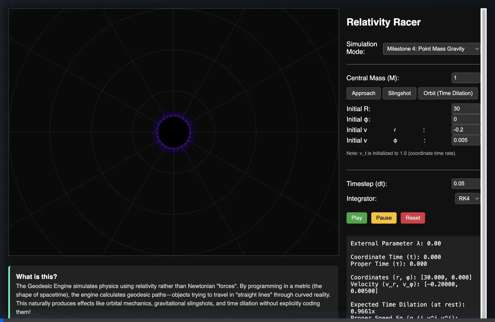

# Geodesic Engine (Relativity Racer)

The **Geodesic Engine** is a geometry-driven physics simulator written in TypeScript. 

Unlike traditional Newtonian physics engines that move objects by applying force vectors ($F=ma$) in an absolute background space, this engine utilizes **Differential Geometry** and **General Relativity**. Objects simply attempt to travel in a "straight line" (a geodesic). If the underlying geometry (the *manifold*) is curved, this straight-line motion appears to an outside observer as complex orbital mechanics, gravitational bending, or acceleration.

By simply changing the mathematical definition of spacetime (the **Metric**), the exact same core engine can natively simulate walking on a sphere, time dilation in Special Relativity, or slingshotting around a Black Hole.

---

## 1. The Mathematics: Equations of Motion

The core of the simulation relies on numerically integrating the **Geodesic Equation**:

$$ \frac{d^2x^\mu}{d\lambda^2} = -\Gamma^\mu_{\alpha\beta} \frac{dx^\alpha}{d\lambda} \frac{dx^\beta}{d\lambda} $$

Where:
- $x^\mu$ are the generalized intrinsic coordinates (e.g., $r, \theta, \phi, t$).
- $\lambda$ is an affine parameter along the curve (often coordinate time $t$ for spatial geodesics, or proper time $\tau$ for relativistic ones).
- $\frac{dx^\mu}{d\lambda}$ is the velocity vector $v^\mu$.
- $\Gamma^\mu_{\alpha\beta}$ are the **Christoffel Symbols of the Second Kind**, which mathematically encode the curvature of the manifold.

The engine calculates the $\Gamma$ terms provided by a given `Geometry` class, and feeds the resulting acceleration $\frac{dv^\mu}{d\lambda}$ to a numerical integrator (like standard Runge-Kutta 4) to step the state $[x, v]$ forward in time.

If tracking Relativistic Proper Time ($\tau$), the engine also simultaneously integrates the proper time accumulation rate defined by the metric tensor $g_{\mu\nu}$:
$$ d\tau = \sqrt{-g_{\mu\nu} v^\mu v^\nu} \ d\lambda $$

---

## 2. Manifolds & Metrics Modeled

The engine's physics are completely decoupled from any specific geometry. We currently implement the following classes of manifolds:

### Spatial Geodesics (Milestones 1 & 2)
- **Flat 2D Plane ($x, y$):** 
  - *Metric:* $g_{ij} = \delta_{ij}$ (Identity matrix). 
  - *Christoffel:* All zero. Objects move in Cartesian straight lines.
- **2D Sphere ($\theta, \phi$):** 
  - *Metric:* $g_{\theta\theta} = 1$, $g_{\phi\phi} = \sin^2(\theta)$.
  - *Christoffel:* Non-zero terms like $\Gamma^\theta_{\phi\phi} = -\sin\theta \cos\theta$.
  - *Result:* Objects naturally orbit the sphere along Great Circles (equators). The engine also supports Parallel Transport of vectors along these curves to demonstrate spherical holonomy.

### Spacetime Geodesics (Milestones 3 & 4)
- **Minkowski Spacetime ($t, x$):**
  - *Metric:* Flat 1+1D Lorentzian signature $(-1, 1)$.
  - *Christoffel:* All zero.
  - *Result:* Special Relativity. Particles traversing spacetime inherently experience time dilation. The classic Twin Paradox emerges naturally.
- **Schwarzschild Curved Spacetime ($t, r, \phi$):**
  - *Metric:* The non-rotating Black Hole metric. $g_{tt} = -(1 - \frac{2M}{r})$, $g_{rr} = (1 - \frac{2M}{r})^{-1}$, $g_{\phi\phi} = r^2$.
  - *Christoffel:* Highly non-linear gravitational source terms.
  - *Result:* General Relativity. Particles fall into the central mass $M$. Entering with perpendicular velocity creates stable orbits. Proper time $\tau$ explicitly ticks slower deep in the gravity well due to $g_{tt} < -1$.

---

## 3. Architecture: Separation of Engine and Rendering

A critical architectural constraint of the Geodesic Engine is that **physics and rendering are strictly separated**.

1. **The Core Physics (`Integrator`, `Dynamics`, `Geometry`):**
   - The engine operates entirely in **Intrinsic Coordinates**. It has no concept of "screens", "pixels", or "3D rendering".
   - If the manifold is a Sphere, the engine only tracks the angles $[\theta, \phi]$. It does not know the sphere is round.
   - The `Geometry` interface only provides `metric(x)` and `christoffel(x)` matrices.

2. **The Renderers (`CanvasRenderer`, `SpacetimeRenderer`, `SchwarzschildRenderer`):**
   - Renderers map the engine's abstracted intrinsic numbers onto human-readable visual spaces.
   - For example, the `CanvasRenderer` knows how to map intrinsic $[\theta, \phi]$ angles to an external Cartesian $[X, Y, Z]$ space to draw a 3D wireframe globe on the $2D$ screen.
   - The `SchwarzschildRenderer` knows how to map intrinsic polar coordinates $[r, \phi]$ into an overhead map, drawing the event horizon at $r=2M$.

This clean separation is why the same $RK4$ integration code powers both a 3D sphere simulation and a Black Hole orbital simulator without a single conceptual change to the mathematics!

---

## 4. Why This Engine Is Different

Most game engines simulate motion by applying forces in a fixed Euclidean space.

This engine instead simulates motion as geodesics on a manifold.

That means:

    Geometry → determines motion.

The physics core does not know anything about gravity, spheres, or black holes.

It only integrates the geodesic equation using the metric tensor provided by the selected manifold.

By swapping the Geometry implementation, the same engine can simulate:

- straight lines on a plane
- great-circle navigation on a sphere
- relativistic time dilation in Minkowski spacetime
- orbital motion in curved Schwarzschild spacetime

In other words:

    the geometry of spacetime itself becomes the "physics engine".

---

## Example: Orbital Motion in Schwarzschild Spacetime

Below is a particle orbiting a central mass M.

The particle is not experiencing a force.
Instead, it is following a geodesic of the Schwarzschild metric.

The resulting path appears to an outside observer as a gravitational orbit.



---

## Running the Project

```bash
npm install
npm run dev
```

The Vite server will start precisely at `http://localhost:5173`. Use the dropdown in the UI to jump between the various topological and relativistic manifolds!
